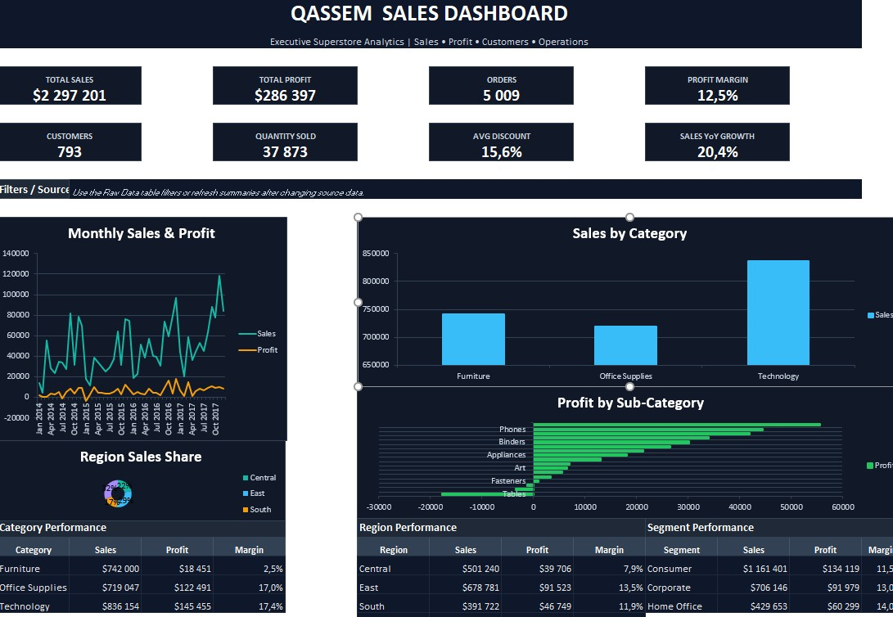

# 📊 Sales Data Analysis & Business Dashboard

## 🚀 Project Overview
This project analyzes Superstore sales data to uncover actionable business insights about sales performance, profitability, customers, products, regions, and shipping operations.

The goal is to transform raw sales data into a clear Excel dashboard that helps business users understand performance and make better decisions.

---

## ❓ Business Questions
This project answers the following business questions:

- Which region generates the highest sales and profit?
- Which product categories and sub-categories are the most profitable?
- Which states and cities perform best or worst?
- How do sales and profit change over time?
- How does discounting affect profitability?
- Which shipping modes are most commonly used and profitable?

---

## 🛠️ Tools Used

- Microsoft Excel
- Pivot Tables
- Data Cleaning
- Data Transformation
- Dashboard Design
- Business Analysis

---

## 📁 Dataset Overview

The dataset contains **9,994 rows** of sales transactions with fields such as:

- Order Date
- Ship Date
- Customer Segment
- Region
- State
- City
- Category
- Sub-Category
- Sales
- Quantity
- Discount
- Profit
- Shipping Days

---

## 📈 Key Metrics

| Metric | Value |
|---|---:|
| Total Sales | $2,297,200.86 |
| Total Profit | $286,397.02 |
| Total Orders | 5,009 |
| Total Customers | 793 |
| Quantity Sold | 37,873 |
| Profit Margin | 12.47% |

---

## 🔍 Key Insights

### 1. Regional Performance
- The **West** region generated the highest profit with **$108,418.45**.
- The **East** region ranked second with **$91,522.78** in profit.
- The **Central** region had the lowest profit despite generating over **$501K** in sales, which indicates lower profitability.

### 2. Category Performance
- **Technology** was the most profitable category with **$145,454.95** in profit.
- **Office Supplies** generated **$122,490.80** in profit.
- **Furniture** had high sales of **$741,999.80** but only **$18,451.27** profit, showing weak margins.

### 3. Sub-Category Performance
- **Copiers** were the most profitable sub-category with **$55,617.82** profit.
- **Phones** and **Accessories** also performed strongly.
- **Tables** caused the largest loss with **-$17,725.48** profit.
- **Bookcases** and **Supplies** also showed negative profitability.

### 4. State & City Performance
- **California** had the highest sales and profit with **$76,381.39** profit.
- **New York** followed closely with **$74,038.55** profit.
- **Texas**, **Ohio**, and **Pennsylvania** were among the weakest states by profit.
- **New York City** was the most profitable city with **$62,036.98** profit.

### 5. Yearly Sales Trend
- Sales increased strongly from **2016 to 2017**.
- 2017 was the best year with **$733,215.26** in sales and **$93,439.27** profit.
- Sales grew by approximately **20.36%** from 2016 to 2017.

### 6. Discount Impact
- Orders with **0% discount** produced the strongest profit margin at around **29.5%**.
- Discounts above **20%** started generating negative profit.
- Discounts above **50%** caused very large losses, with a profit margin of approximately **-119.2%**.

---

# 📊 Sales Data Analysis & Business Dashboard

## 🚀 Project Overview

This project analyzes sales data to uncover actionable insights that support business decision-making, improve profitability, and identify growth opportunities.

---

## ❓ Business Problem

Businesses often struggle to identify which regions, products, and time periods generate the highest profit.

This project addresses these challenges through data analysis and visualization.

---

## 🎯 Key Questions

* Which regions generate the highest profit?
* Which products are the most and least profitable?
* How do sales trends change over time?
* What is the impact of discounts on profitability?

---

## 🛠️ Tools Used

* Microsoft Excel
* Data Cleaning & Transformation
* Pivot Tables
* Dashboard Design

---

## 📈 Dashboard Features

* 💰 Total Sales
* 📊 Total Profit
* 📦 Total Orders
* 📉 Profit Margin
* 📅 Monthly Sales Trends
* 🌍 Sales by Region
* 📦 Sales by Category
* 📊 Profit by Sub-Category

---

## 📊 Key Insights

* West and East regions generate the highest profits
* Furniture category has lower profitability due to high discounts
* Discounts above 20% significantly reduce profit margins
* Some sub-categories like Phones and Copiers drive strong profits

---

## 💡 Business Recommendations

* Focus more on the **West** and **East** regions because they generate the highest profits
* Review pricing and discount strategies for **Furniture**, especially **Tables** and **Bookcases**
* Reduce discount rates above **20%** to prevent losses
* Increase investment in profitable sub-categories such as **Copiers**, **Phones**, and **Accessories**
* Investigate weak-performing states such as **Texas**, **Ohio**, and **Pennsylvania**

---

## 📷 Dashboard Preview



---

## 📂 Project Files

```text
sales-data-analysis/
│
├── Qassem_Pro_Dashboard.xlsx
├── README.md
└── images/
    └── dashboard.png
```

---

## 🔮 Future Improvements

* Build an interactive Power BI dashboard
* Perform exploratory data analysis using Python
* Develop a sales prediction model using machine learning
* Deploy an interactive dashboard using Streamlit

---

## 👨‍💻 Author

**Qassem Adra**
Data Analyst | Data Science Enthusiast

---

## ⭐ Final Note

This project demonstrates my ability to transform raw data into meaningful business insights and actionable recommendations.


## 👨‍💻 Author

**Qassem Adra**  
Data Analyst | Data Science Enthusiast

---

## ⭐ Final Note

This project demonstrates my ability to clean, analyze, and visualize business data, then translate it into clear insights and actionable recommendations.
